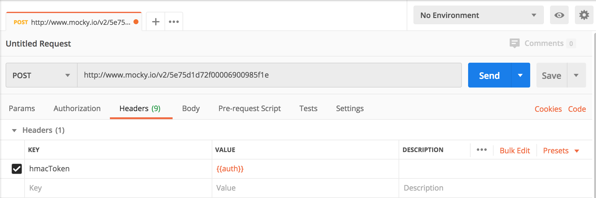
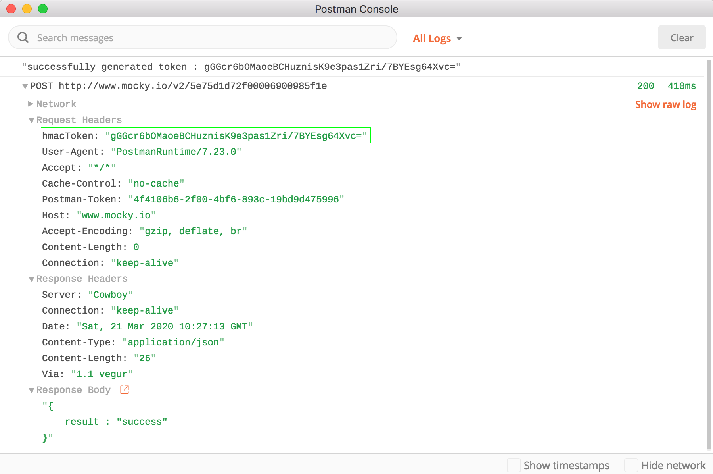
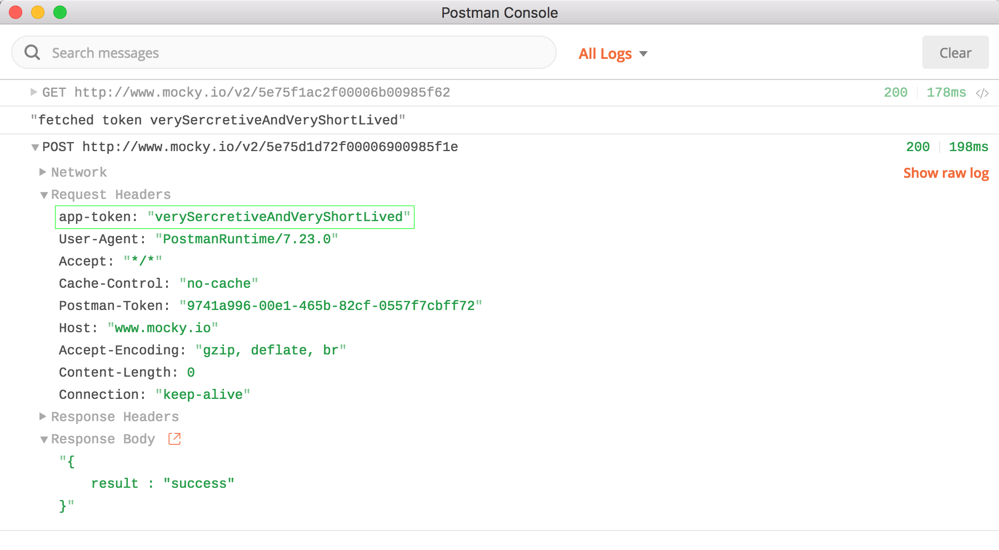

## Introduction

Postman has become a default option to make and test API requests. Although we might be familiar with making basic http requests with postman, it gives us a lot more power in terms of programming things around an API request. In real world scenarios there are three ways we handle params and process them further.

First is when the params are just user inputs and you can plainly use for further processing like fetching from DB.

Second use case is when the params themselves are computed on clients and then sent to servers. These can be a things like generating a signature containing timestamps so they will be different every time. 

Third is when your clients chain requests i.e. they make an API call and use the response of this API call as the params of next API call.

While the first use case is fairly simple to test on postman, second and third cases are tricky. For second you will have to run a script to generate those real time params and then manually enter them in postman. For third you will make the first API call, copy response and use those as params in next API call. If you are lazy like me this seems too much trouble, especially when your params have expiry and you have limited time window to do those operation manually. 

Enter pre request scripts. Postman allows you to write a pre request script which will run before the actual API call and do the all the things which were doing manually. Lets look at both of the cases with a detailed example.

### Generating real time params

There are APIs which require you to have a param (or header) which is generated in real time, i.e. its value will change with every API request. Lets look at example :

We have to make a POST API call to `http://www.mocky.io/v2/5e75d1d72f00006900985f1e` which will only succeed if the request contains a header `hmacToken`. This `hmacToken` is generated via signing a string containing your token and timestamp with a secret. If we were to do this without pre request script we will have to run this algorithm, use the output as header and make the call. We can automate it like this :

* Make a basic request with `http://www.mocky.io/v2/5e75d1d72f00006900985f1e` as url and method as `POST`.
* Add a header with `hmacToken` as key and `{{auth}}` as value. This `auth` is a dynamic value and will be generated using pre request script.



* Pre-request scripts allows you to write javascript and hence we can write js code to implement the singing function. In the `Pre-request Script` add the following code snippet: 
   
```js
const crypto = require('crypto-js');
const token = "myLongLivedToken"
const secret = "iKillFascists"

const signToken = () => {
    const dateTime = (new Date).getTime().toString()
    const stringToSign = `${token}-${dateTime}`;
    const hash = crypto.HmacSHA256(stringToSign, secret)
    return crypto.enc.Base64.stringify(hash);
}

const signedToken = signToken()

console.log(`successfully generated token : ${signedToken}`)

pm.globals.set("auth", signedToken);
```
* Its a simple script to generate a HmacSHA256 hash using crypto-js which is inbuilt in postman sandbox. Notice how the string which we are signing with secret contains timestamp and hence will always be different. The only piece which is specific to postman is `pm.globals.set("auth", signedToken);` . Here we are assigning the `signedToken` to a variable `auth`. This auth can now be used in post params, headers, body or even the url.

* Now we can go ahead and make the api call. It should now use the signed token in `hmacToken` header. To verify this we will use another very handy thing which postman provides, Postman Console. This console will show us all the console logs in our script as well as the request response details. Use `cmd+alt+c` (`ctrl+alt+c` on windows) to open up the console and `Send` the api request.



As the postman console shows, we were able to generate a signature using pre-request script and use that in our headers. We can extend this idea and use the scripts to generate value and assign them to variables then use those variable in postman. 

### Chaining Requests

Sometimes to perform an operation we need to chain few api requests, i.e. response from first API call is used as request params for the second API call. Instead of making two API call and copying over data we can use pre-request script for the same. Lets look at an example 

We have to make a POST API call to http://www.mocky.io/v2/5e75d1d72f00006900985f1e which will only succeed if we have a the request has a header `app-token`. We get this `app-token` by making another GET call to `http://www.mocky.io/v2/5e75f1ac2f00006b00985f62`. We can automate the whole flow like this :

* Make a basic request with `http://www.mocky.io/v2/5e75d1d72f00006900985f1e` as url and method as `POST`.
* Add a header with `app-token` as key and `{{token}}` as value. This `token` is a dynamic value and will be fetched using pre request script.
* In the `Pre-request Script` add the following code snippet: 

```js
const reqObject = {
  url: 'http://www.mocky.io/v2/5e75f1ac2f00006b00985f62',
  method: 'GET',
  header: 'Content-Type:application/json'
};

pm.sendRequest(reqObject, (err, res) => {
    const {token} = res.json()
    console.log(`fetched token ${token}`)
    pm.globals.set("token", token);
});
```
* We are using `pm.sendRequest` to make an API request and then assigning the response to variable `token` which is dynamic header value.
* Now we can go ahead and make the api call. It should now use the fetched token in `app-token` header. We will again use postman console to confirm this.



We were successfully able to chain reqeust and save us manual work of making an extra API call. This is a one time effort of writing the script but will save you tons of pain and time.

### How does this works?

Postman provides us with a javaScript execution environment called Postman Sandbox. This sandbox is available to us in pre-request scripts and hence allows us to run javascript. Apart from `pm.globals` and `pm.sendRequest` we have used in this article postman sandbox provides us with a ton of more sandbox [API](https://learning.postman.com/docs/postman/scripts/postman-sandbox-api-reference/) to help us implement complex logic in script.

### Conclusion
We learned how to automate using dynamic params either by generating them or by fetching them via another API call. This comes in really handy especially with authenticated calls where the auth tokens are very short lived.


