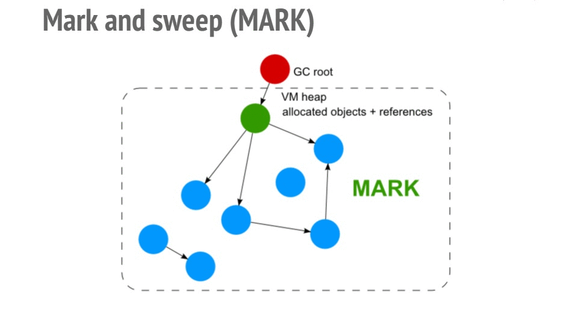
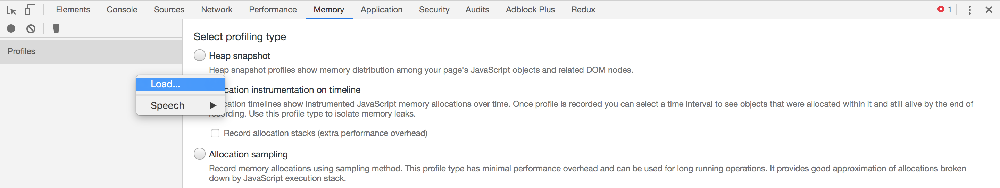
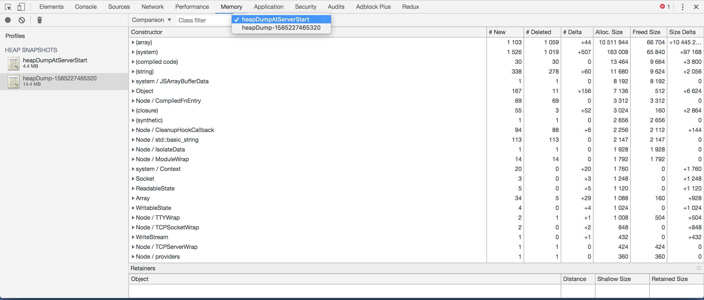
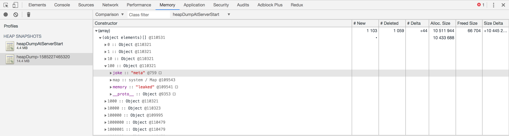

## Introduction

Memory leaks are like parasites of an application, they creep up into your systems unnoticed and don't cause any harm initially, but once leaks are strong enough they can cause catastrophic problems to your application such as high latencies and crashes. In this article we will look at what are memory leaks, how javascript manages memory, how to identify leaks in a real world scenario and eventually how to fix them.

Memory leaks can be broadly defined as a chunk of memory which is no longer required by your application but isn't available to your OS for further usage. In other words a block of memory which is being taken up your application with no intention of using it in future. 

### Memory Management

Memory management is a way of assigning memory from your machine memory to your application and then releasing that memory back to your machine when no longer in use. There are multiple ways of memory management and it depends on the programming language you are using. Below are a few ways of memory management :

* **Manual memory management** : In this paradigm of memory management, the programmer is responsible for both assigning and then releasing the memory. The language by default wont provide any automated tools to do so for you. While it gives you extreme flexibility, its an added overhead too. `C` and `C++` use this approach to manage memory and provide methods like `malloc` and `free` to coordinate with machine memory.

* **Garbage collection** : Garbage collected languages does memory management for you out of the box. Programmer don't need to worry about freeing up memory as an inbuilt garbage collector will do this for you. How it works and when will it trigger to free up unused memory will mostly be black box to developers. Most modern programming languages like `Javascript`, `JVM based languages (Java, Scala, Kotlin)`, `Golang`, `Python`, `Ruby` etc are garbage collected languages. 

* **Ownership** : In this approach of memory management each variable must have its owner and as soon as the owner goes out of scope, the value in the variable will be dropped, releasing memory. `Rust` uses this approach of memory management. 

There are many other ways of managing memory which languages use such as [RAII](https://theboostcpplibraries.com/raii-and-memory-management) used by `C++11` and [ARC](https://docs.swift.org/swift-book/LanguageGuide/AutomaticReferenceCounting.html) used by `Swift` but thats out of scope of this article. The pros, cons and comparison between each of these methods calls for an article of its own. Someday.

Since the darling language of web developers and and the language in the scope of this article is Garbage Collected, we will look deeper into how garbage collection works in Javascript.

### Garbage Collection in Javascript

As mentioned in the above section, javascript is a garbage collected language and hence an engine called Garbage Collector runs in periodically and  checks which allocated memory can still be reached by your application code, i.e. which variables you still have a reference too. If it finds some memory is not referenced by application it will release it. There are two main algorithms for the above approach. First is `Mark and Sweep` which is used by `Javascript` and second is `Reference counting` which is used by `Python` and `PHP`.



Mark and sweep algorithm first creates a list of roots which are global variables in the environment (`window` object in browser) and then traverses the tree from roots to leaf nodes and marks all objects it encounters. Any memory not taken up by marked objects in the heap is marked as free.

### Memory Leaks in Node Application 

We now know enough theory about memory leaks and garbage collection to dive into real world application. In this section we will write a node server which has leak, try and identify that leak using different tools and then eventually fix it.

#### Introducing a Leaky Code

For the sake of demo, I have a built an express server which has a leaky route in it. We will use this API server for debugging. 

```javascript
const express = require('express')

const app = express();
const port = 3000;

const leaks = [];

app.get('/bloatMyServer', (req, res) => {
	const redundantObj = {
		memory: "leaked",
		joke: "meta"
	};

	[...Array(10000)].map(i => leaks.push(redundantObj));

	res.status(200).send({size: leaks.length})
});

app.listen(port, () => console.log(`Example app listening on port ${port}!`));
```

Here we have a `leaks` array which is outside the scope of our API and hence each time this is called, it will keep pushing data to that array without ever cleaning it. Since it will always be referenced, the GC will never release the memory taken up by it.

#### Bloating up our Server
This is where things get interesting. There are a lot of articles on web telling how to debug memory leaks in your server by first hitting it multiple time with tools like [artillery](https://artillery.io/) and then debugging using `node --inspect` but there is a major issue with this approach. Imagine you have an API server with hundreds of APIs with each API taking in multiple params which triggers different code paths. So in real world scenarios where you have no clue where your leak lies, to bloat up your memory in order to debug the leak you will have hit every API with every possible params multiple times. That to me sounds like a very tricky thing to do unless you have tools like [goreplay](https://goreplay.org/) which allow to you record and replay real traffic on your test server.

To fix this issue we are going to debug this in production, i.e. we will allow our server to bloat up in production (as it will get all kinds of api request) and once we find memory usage going up, we will start debugging it. 

#### Heapdump

To understand what a heapdump is we first need to understand what a heap is. To put in extremely simple terms heap is the place everything gets thrown at and it’s stays there until GC removes what’s supposed to be junk. A heap dump is a snapshot of your current heap. It will contain all the internal and user defined variable and allocations which are currently present in Heap. 

So if we can somehow compare heapdump of a fresh server vs heapdump of a long running bloated server we should be able to identify the objects that are not being picked up by GC by looking at the diff. 

But first lets look at how to take a heapdump. We will use an npm library [heapdump](https://www.npmjs.com/package/heapdump) which allows us to take a heapdump of the server programmatically. To install do :

```terminal
npm i heapdump
```
We are going to make few changes in our express server to use this package. 

```js
const express = require('express');
const heapdump = require("heapdump");

const app = express();
const port = 3000;

const leaks = [];

app.get('/bloatMyServer', (req, res) => {
	const redundantObj = {
		memory: "leaked",
		joke: "meta"
	};

	[...Array(10000)].map(i => leaks.push(redundantObj));

	res.status(200).send({size: leaks.length})
});

app.get('/heapdump', (req, res) => {
	heapdump.writeSnapshot(`heapDump-${Date.now()}.heapsnapshot`, (err, filename) => {
		console.log("Heap dump of a bloated server written to", filename);

		res.status(200).send({msg: "successfully took a heap dump"})
	});
});

app.listen(port, () => {
	heapdump.writeSnapshot(`heapDumpAtServerStart.heapsnapshot`, (err, filename) => {
		console.log("Heap dump of a fresh server written to", filename);
	});
});
```
We have used the package to take a heapdump as soon as the server starts and written an API to take a heapdump when we call the API `/heapdump`. We will call this API when we realise that our memory consumption has gone up.

>If you are running your application inside a kube cluster, you wont be able to hit your desired high consumption pod. To do so you can use [port forwarding](https://kubernetes.io/docs/tasks/access-application-cluster/port-forward-access-application-cluster/) to hit that specific pod in cluster. Also since you wont we able access the file system to download these heampdumps, you can upload these heapdumps to cloud (s3).


#### Identifying the Leak

So now our server is deployed and has been running for days. Its being hit by a number of request (only one in our case) and we have observed that the memory consumption of our server has spiked (you can do so using monitoring tools like [Express Status Monitor](https://github.com/RafalWilinski/express-status-monitor), [Clinic](https://clinicjs.org/), [Prometheus](https://prometheus.io/)). We will now make the API call to take a heapdump. This heapdump will contains all the objects which GC wasn't able to collect.

```terminal
curl --location --request GET 'http://localhost:3000/heapdump'
```

> Taking a heapdump forces GC to trigger and hence we don't have to worry about memory allocations which might be collected GC in future but are currently inside heap i.e. non leaky objects.

Once you get your hands on both the heapdumps (fresh and long running server) we can start comparing.

> Taking a heapdump is a memory intensive and blocking operation and should be done with care. Read this [caveat](https://www.npmjs.com/package/heapdump#caveats) for more info.

Open up chrome and hit *F12*. This will open up chrome console, go to `Memory` tab and `Load` both the snapshots.



After loading both the snapshots change the `perspective` to `Comparison` and click on the long running server's snapshot



We can go through `Constructor` and look at all the objects GC didn't sweep. Most of them would be internal reference which nodes uses, one neat trick is to sort them by `Alloc. Size` to check most heavy memory allocations we have. If we expand `array` and then expand `(object elements)` we will be able to see our `leaks` array containing insane amount of objects in it which is not picked up GC.



We can now pin point to `leaks` array as the cause of high memory consumption.

#### Fixing the Leak

Now that we know array `leaks` is causing the trouble, we can look at the code and pretty easily debug that its because the array is outside the scope of request cycle and hence its reference is never deleted. We can fix it fairly easily by doing :

```js
app.get('/bloatMyServer', (req, res) => {
	const redundantObj = {
		memory: "leaked",
		joke: "meta"
	};

	const leaks = []; //highlight-line

	[...Array(10000)].map(i => leaks.push(redundantObj));

	res.status(200).send({size: leaks.length})
});
```

We can verify this fix by repeating the above steps and comparing snapshots again.

### Conclusions

Memory leaks are bound to happen in garbage collected languages like javascript. Fixing a memory leak is the easy although identifying them is a real pain. In this article we learnt about basics of memory management and how its done by various languages. We mocked a real world scenario and tried to debug its memory leak and eventually fixed it.