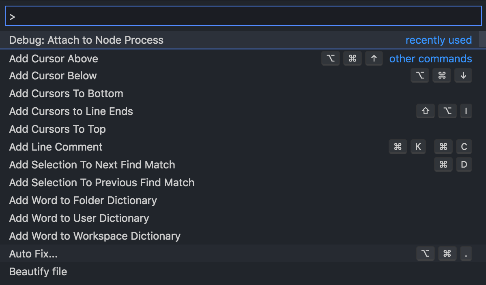
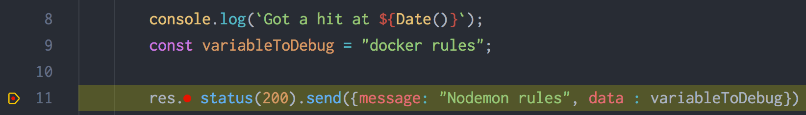
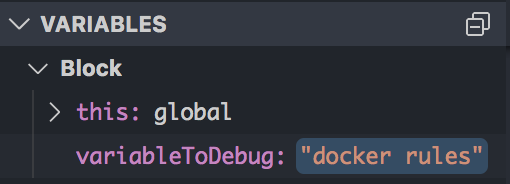

## Introduction

With the rise of microservice architecture, the tooling around it has grown tremendously with docker becoming the defacto choice for containerization. A docker container is much lighter that a full fledged virtual machine and allows you to run your applications inside a sandbox environment which is completely isolated from the host machine. These application can then be packaged for easy sharing across multiple platforms. As your services are encapsulated inside a container, we don't have as much liberty to debug them in real time, as we do when running our service locally without docker. The container OS is running in isolation from your local machine OS. As a result of this we wont be able to make changes to our code and have them reflect in real time and also we wont be able to make request to our servers from outside the containers. In this article we will look at how to dockerize your Node.js application and then debug them in real time when running inside docker containers. 


## Setup 

First lets look at a simple API server written in Node.js. We will use this sample server to dockerize and then later debug it.

```js
const express = require('express');
const app = express();
const port = 3000;

app.get('/', async (req, res) => {
	try {

		console.log(`Got a hit at ${Date()}`);
		const variableToDebug = "docker rules";

		res.status(200).send({message: "Success", data : variableToDebug})

	} catch (err) {

		console.log(err);
		res.status(500).send({message: "Something went wrong"})
	}

});

app.listen(port, () => console.log(`app listening on port ${port}!`));
```

This is `app.js` of our node server and can run be using `node app.js`. 

## Dockerizing your app

We will now dockerize our express server. We can do so just by using `docker-cli` which is a utility docker provides which can be used to interact with docker using shell. However it will a huge command with alot of flags and hence we will use `Dockerfile` for the same. A `Dockerfile` is config file which can used to configure the steps involved in building a docker image. This way we can share our server and somebody else can use our Dockerfile to build images. Create a new file with name `Dockerfile` and paste the following.

```bash
FROM node:latest

WORKDIR /app

COPY package.* /app

RUN npm install

COPY . /app

CMD node app.js

EXPOSE 3000
```

`FROM` specifies the container base image: node:latest. This image will contain the latest node and npm installed on it.

`WORKDIR` defines the folder which will contain our code inside the container.

`COPY` is used to copy files from your local file to container directory. Docker builds each line of a Dockerfile individually. This forms the 'layers' of the Docker image. As an image is built, Docker caches each layer. Hence when we copy package.json and package-lock.json to our directory and `RUN` `npm install` before doing the `COPY` of complete codebase, it allows us to take adavantage of caching. As a result of above order, docker will cache for `node_modules` and wont install again unless you change `package.json`.

`CMD` is used to fire shell commands which be executed inside the container. We use this to start our server.

`EXPOSE` does not publish the port, but instead functions as a way of documenting which ports on the container will be published at runtime. We will open the ports while running the image.

Use this command to build the image of our application :

```terminal
docker build -t node-docker .
```

This commands builds the image for application with `-t` flag specifying the name we want to give our image. To verify use command `docker images`. 

```terminal
docker images

REPOSITORY          TAG                 IMAGE ID            CREATED              SIZE
node-docker         latest              0567f36cdb70        About a minute ago   950 MB
node                latest              c31fbeb964cc        About a minute ago   943 MB
```

We have build the image and we will use this image to run a container. Think of image as a recipes and container as a cake. You can make (run) as many cakes (running instance of image) from the recipe (image). Use this command to start the container : 

```terminal
docker run --rm -it --name node-docker -p 3000:3000 node-docker
```

The `--rm` flag automatically stops and removes the container once the container exits. The `-i` and `-t` flag combined allows you to work with interactive processes like shell. The `-p` flag maps a local port 3000 to a container port 3000. This is our gateway into container. We can ping `localhost:3000` which will hit the local 3000 port and then the container will forward that request to our server running on 3000 inside it. This will start up your server as well and you can verify by : 

```terminal
curl --location --request GET 'http://localhost:3000'

{"message":"Success","data":"docker rules"}
```

## Interacting with docker 
We have fully dockerized our server and now its running inside an isolated container. Two things to note from the above setup is :

1) We have configured dockerfile to `COPY` the code from our local directory into the `/app` directory of container. This means that any changes you make post building the image wont be reflected and you will have to build the image again in order to incorporate those changes.

2) We have to open ports on a container and map it to any internal ports if we want to access. So if we have some other process running on some port we can open it and access it outside our container. 

We will solve first one by configuring the docker to use our local directory for code and not copy it at the time of building. We will use the second one to start some debug processes which we can attach to our debuggers. 

## Debugging inside docker

### Console.log aka caveman debugging 

Caveman debugging is a way of logging variables and strings inside your code so that you can see the statements when that code path triggers. While it is frowned upon we have all been guilty of it and it might actually be helpful in case of naive usecases. Useful or not, knowing how to do so using docker will still help us. 

As mentioned that docker copies over the code from your directory while building the image so our dynamic `console.log` wont reflect in the code base. To do so, we will have to use [bind mount](https://docs.docker.com/storage/bind-mounts/) to mount our local directory as the code directory inside container. To do we just have to remove the copying and installing step from our dockerfile. So our new `Dockerfile` looks like this :

```bash
FROM node:latest

WORKDIR /app

CMD node app.js

EXPOSE 3000
```

We will build the image again using `docker build -t node-docker .` Now while running the container we will specify the mount point and location to mount inside the container. Our run command now becomes :

```
docker run --rm -it --name node-docker -v $PWD:/app -p 3000:3000 node-docker
```

The `-v` flag mounts a local folder into a container folder using this mapping as its arguments `<local relative path>:<container absolute path>`. As our `WORKDIR` is `/app` we use `/app` for container directory and `pwd` to for our current code. This will spawn our server using code on our local machine instead of creating a copy of it inside the container. 

But there is still a problem, even when you are running a server without docker, a code change is not reflected on you server untill you restart your server. This where `nodemon` comes in. [Nodemon](https://www.npmjs.com/package/nodemon) is a neat tool to restart your server automatically as soon as a code change happens. It basically watches all the files inside a directory and triggers a restart when something changes. 

Install nodemon using `npm install --save-dev nodemon`. 

>We are installing nodemon locally and hence nodemon will not be available in your system path. Instead, the local installation of nodemon can be run by calling it from within an npm script.

Inside our package.json we will add a start script : 

```js
"scripts": {
    "start": "nodemon app.js"
  }
```

And inside our `Dockerfile` we change the execution command to start server :

```bash
FROM node:latest

WORKDIR /app

CMD npm start //highlight-line

EXPOSE 3000
```

Run the container using same command : `docker run --rm -it --name node-docker -v $PWD:/app -p 3000:3000 node-docker`.

Now our container will use nodemon to start the server and nodemon will restart the server inside the container if any code change occurs. Since the nodemon will be watching the code on local machine we can make changes and it will reflect in real time! Lets verify this by making the change to response of our api and hitting it the api again. We don't need to build image or even restart the container.

```js
try {
		console.log(`Got a hit at ${Date()}`);
		const variableToDebug = "docker rules";

		res.status(200).send({message: "Nodemon rules", data : variableToDebug}) //highlight-line
	}
```

```terminal
curl --location --request GET 'http://localhost:3000'

{"message":"Nodemon rules","data":"docker rules"}
```

### Using Debuggers

For more sophisticated folks who have evolved from caveman to civilized people we will want to use debugger to debug our application. Debuggers allow you to set breakpoints inside your code and allows you see variable values at that particular point in execution.

Before using a debugger inside docker, first lets see how does a debugger works. When you start your node server with `--inspect` flag, a Node.js process starts and starts listening on a port. Any inspector client can attach itself to this process, be it an IDE debugger or Chrome DevTools. 

So debugger is just another process running on some port. If we had been debugging without docker we would just attach our debugging client on 9229 (default port) and things will work. As we can expose port from container to local machine we will use this trick to expose debug process as well. 

First lets change the start script to run the node server in inspect mode. To do this change the start script to `nodemon --inspect=0.0.0.0 app.js`. This will start nodemon in inspect mode and run the debugger on 9229 port.

Second we will expose the 9229 port. We can do this by changing the run command to :

```terminal
docker run --rm -it --name node-docker -v $PWD:/app -p 3000:3000 -p 9229:9229 node-docker
```

This will start our server in inspect mode and also expose the debug port for us to use.

You can verify if you debugger is running and you can access it by using command :
```terminal
lsof -i :9229
```

We can now go ahead and attach this process to our IDE's debugger. Since VS Code is the most popular IDE, we will look at how attach this debugger in VS Code, but its pretty much the same process to do so in webstrom or atom as well. 

Press `Cmd(Ctrl)+Shift+P` and find `“Debug: Open launch.json”`:



In the `launch.json` file, paste the following :

```json
{
    "version": "3",
    "configurations": [
        {
            "name": "Attach",
            "type": "node",
            "request": "attach",
            "port": 9229,
            "address": "localhost",
            "restart": true,
            "sourceMaps": false,
            "localRoot": "${workspaceRoot}",
            "protocol": "inspector",
            "remoteRoot": "/app"
        }
    ]
}
```

Attach the debugger by clicking on `Run` on VS Code debug page. It will attach the debugger. Now add some breakpoints. 



Lets hit the server and see if the breakpoint capture it.

```terminal
curl --location --request GET 'http://localhost:3000'
```

VS Code must come up and should be able to inspect various variables.



So we are now able to debug our application using IDE's debugger. We can make changes to our code, add log lines, add break points without rebuilding our images. 

## Conclusion 

We have learnt how to run our node application inside a isolated docker container and also how to debug them by configuring docker to use our local machine's code directory and also by exposing the debugger port.

The helper code for this article available on [github](https://github.com/arbazsiddiqui/node-docker).