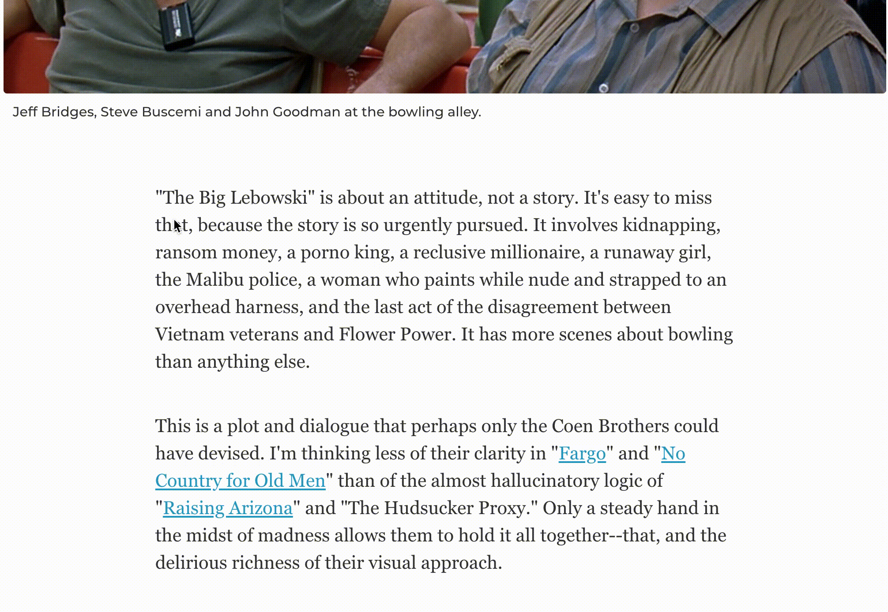
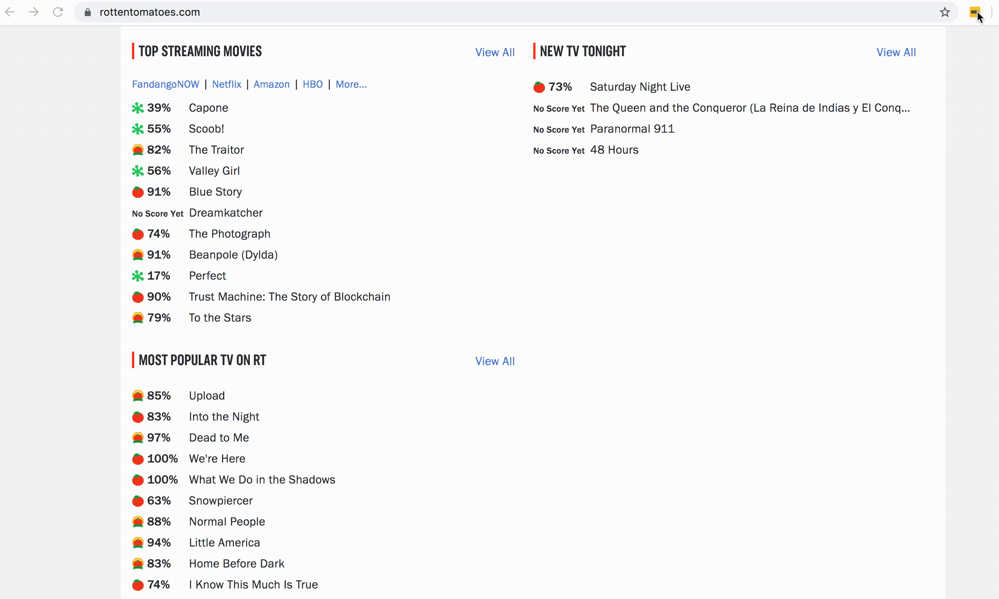
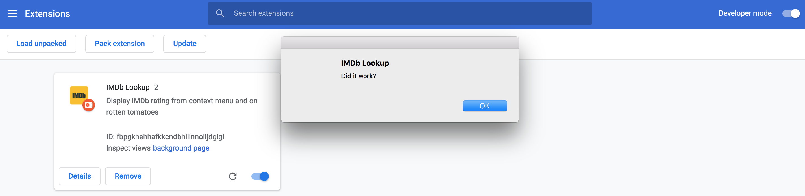
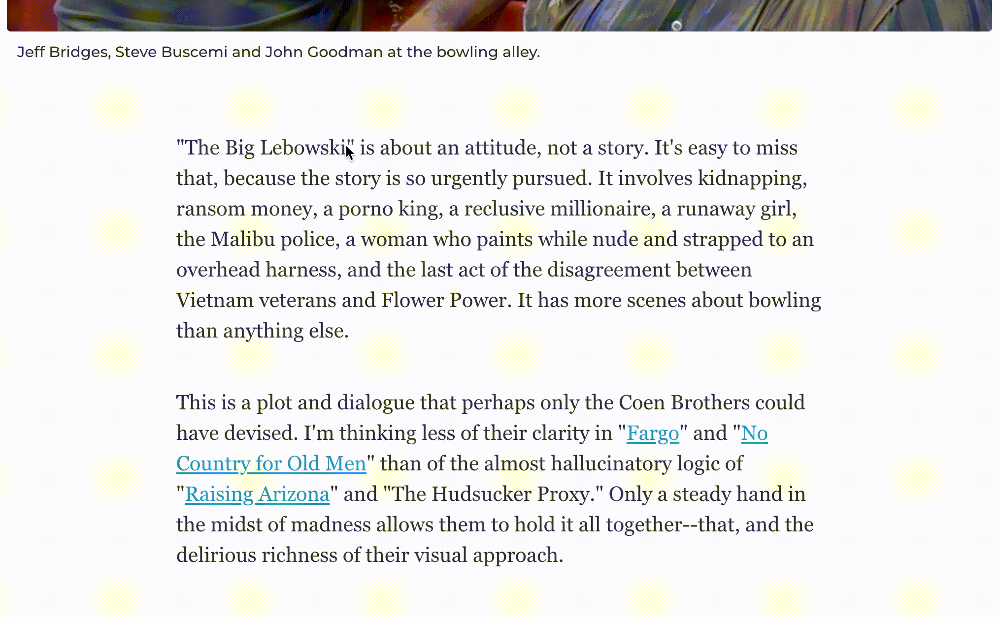
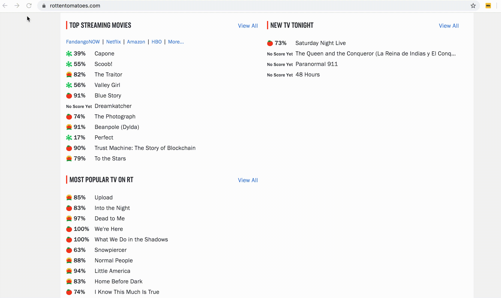
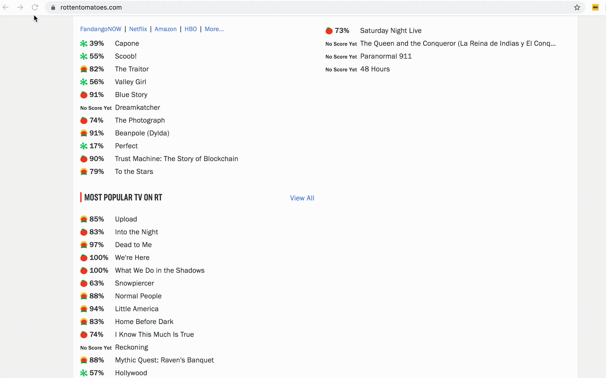
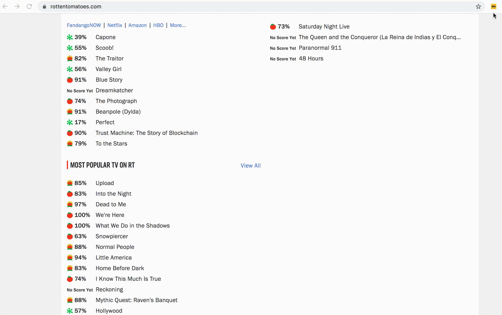

## Introduction
Browser extensions are programs which can modify and enhance your browsing experience. From small UI enhancements to automation, extensions can be used and built for a wide array of use cases. In this article we will look at a step by step guide to build a chrome extension.

What are we building? Well our extension will have two jobs, first will be to fetch [IMDb](https://www.imdb.com/) details of any movie from the context menu (right click menu), like this :



Second will be demonstrating interaction with web pages and hence fetching IMDb ratings on [Rotten Tomatoes](https://www.rottentomatoes.com/) home page when we click on extension button and will look like this :



Notice how all movie titles are appended with `({imdbRating})` after we click on extension icon.

The reason for the dual purpose is to demonstrate how to build background extensions (background scripts), extensions which interact with active web page (content scripts) and how to communicate between the two (message passing).

You can find the complete code [here](https://github.com/arbazsiddiqui/IMDB-Lookup-Extension).

### Setup
Every chrome extension requires a `manifest.json` file. Think of it as configuration file which will tell chrome how to treat this extension. Lets just create a basic manifest file with : 

```js
{
  "name": "IMDb Lookup",
  "description": "Display IMDb rating from context menu and on rotten tomatoes",
  "version": "0.1",
  "manifest_version": 2
  "background": {
    "scripts": ["background.js"]
  },
  "browser_action": {
    "default_icon": "icon.png"
  },
}
```

`name` and `description` are self descriptive and will be same on the chrome web store when you publish your extension. 

Background scripts are the javascript files which will be running in the background across all pages. They don't have access to current web page and hence can't access DOM for reading or manipulations but they do have access to all [chrome APIs](https://developer.chrome.com/extensions/api_index). As we need to create a new entry in the [context menu](https://developer.chrome.com/extensions/contextMenus) of chrome, we will be using a background script.

`browser_action` is used to put icons in the main Google Chrome toolbar, to the right of the address bar. You will have to add some `icon.png` file to your working directory.

> manifest_version 1 is [deprecated](https://developer.chrome.com/extensions/manifestVersion) by chrome and hence should start with 2.

With our manifest ready, lets create a `background.js` file to test if things are working :

```js
//background.js
alert("Did it work?")
```

### Running the extension
To run the extension we have built so far, go to `chrome://extensions/` and toggle the `Developer mode` mode on. Click on `Load unpacked` and browse to the directory containing the extension.



It worked !

Every time you make some changes to the code, just click on reload button on your extension card and chrome will incorporate all the changes.

### Building the background extension
Our use case here is that when we highlight any text and right click, the context that appears should have a new menu saying fetch IMDb details for selected text or something and when you click on this menu you should see the IMDb details like rating and year on a popup. 

To do this we will be using chrome's [context menu](https://developer.chrome.com/extensions/contextMenus) API. First we will have to require its permission by adding it in our manifest.json by adding this : 

```js
  "permissions": ["contextMenus"],
```

Then we can add the following to our `background.js` file. 

```js
//create a context menu
chrome.contextMenus.create({
	//string to display on menu
	'title': 'Search IMDB for "%s"',
	//contexts here is selection as we want to extract the highlighted text.
	'contexts': ['selection'],
	//the event handler
	'onclick': (context) => {
		const name = context.selectionText;
		alert(`Highlighted texts is : ${name}`)
	}
});
```

Reload your extension and test it out! 



So we are now able to get the highlighted text to our event handler and now are free to make API calls. We are going to use [OMDb API](https://www.omdbapi.com/) for fetching IMDb details. Make the following changes to your `background.js` :

```js
//create a context menu
chrome.contextMenus.create({
	//string to display on menu
	'title': 'Search IMDB for "%s"',
	//contexts here is selection as we want to extract the highlighted text.
	'contexts': ['selection'],
	//the event handler
	'onclick': async (context) => {
		const name = context.selectionText;
		const response = await fetch(`https://www.omdbapi.com/?t=${name}&apikey=e48e70b4`)
		const {
			Title,
			Year,
			Runtime,
			Genre,
			Actors,
			imdbRating
		} = await response.json()
		const newLine = "\r\n"
		let message = `Title : ${Title}`
		message += newLine
		message += `Year : ${Year}`
		message += newLine
		message += `Runtime : ${Runtime}`
		message += newLine
		message += `Genre : ${Genre}`
		message += newLine
		message += `Actors : ${Actors}`
		message += newLine
		message += `IMDb Rating : ${imdbRating}`
		alert(message)
	}
});
```

> I am putting my own OMDb's api key here so that you can follow the tutorial with least friction. However if this breaks the internet 🤞and this api key usage reaches the limit, you can claim your free api key from [here](https://www.omdbapi.com/apikey.aspx).


We are making a simple GET call using fetch and then displaying the result. Lets try this out. 


Thats it. We have successfully completed the first part of the tutorial.

### Interacting with webpages
Lets look at our next use case, i.e. displaying IMDb rating next to movie titles on homepage of [Rotten Tomatoes](https://www.rottentomatoes.com/). We wont be able to do this inside our `background.js` file as it doesn't have access to active webpage and hence its DOM. To do this we will have to write [content scripts](https://developer.chrome.com/extensions/content_scripts). Content scripts are files that run in the context of web pages. They will have access to DOM and can read and manipulate it. Add the following to your `manifest.json`

```js
"content_scripts": [{
    "matches": [
      "https://www.rottentomatoes.com/*"
    ],
    "js": ["content.js"]
  }],
```

This piece of configuration tells chrome to load `content.js` file into the webpage whenever the current webpage's URL matches `https://www.rottentomatoes.com/*`. As a result of this we will have access to webpage's DOM inside our `content.js` file. 

Create a `content.js` file and add the following lines :

```js
//content.js
alert("Did it work?")
```

Lets check if this works.



It did work. The alert will only come when we are at rotten tomato website and not on any other website. 

### Building the content script
As we need to manipulate DOM, we might as well use [jQuery](https://jquery.com/). While not necessary at all, its a good idea to know how to use libraries inside chrome extensions. To do this download a version of jQuery from the jQuery CDN and put it in your extension’s directory. To load it, add it to manifest.json before `content.js`. Your **final** `manifest.json` should look like this:

```js
{
  "name": "IMDb Lookup",
  "description": "Display IMDb rating from context menu and on rotten tomatoes",
  "version": "0.1",
  "manifest_version": 2,
  "background": {
    "scripts": ["background.js"]
  },
  "browser_action": {
    "default_icon": "icon.png"
  },
  "permissions": ["contextMenus"],
  "content_scripts": [{
    "matches": [
      "https://www.rottentomatoes.com/*"
    ],
    "js": ["jquery-2.2.4.min.js", "content.js"]
  }]
}
```

Now we can do the following in our `content.js` 
```js
const fetchRatings = () => {
    $(".media-lists__td-title").map(async function () {
        const name = this.innerText;
        const response = await fetch(`https://www.omdbapi.com/?t=${name}&apikey=e48e70b4`)
        const data = await response.json()
        this.innerText = `${name} (${data.imdbRating})`
    })
}

fetchRatings();
```

It some jQuery magic and the same OMDb API call to fetch rating. Lets test this out. 



Voila! We are now able to see IMDb rating on Rotten Tomatoes.

But wait, this is not what we wanted. The DOM was supposed to be manipulated only when we click on our extension's icon on the toolbar and NOT by default. 

We have a problem now. Clicking on extension's icon is a Chrome event and hence our `content.js` wont have access to it and hence wont be able to trigger the `fetchRatings` function. Our `background.js` file will have access to the chrome event but it doesn't have access to DOM and hence cant manipulate it. 

If we can find some way to trigger `content.js` from `background.js` we will be able to achieve the desired behavior.

### Message Passing 

[Message Passing](https://developer.chrome.com/extensions/messaging) is way of communicating between background scripts and content scripts. It allows us to fire events from background scripts and apply event listeners on content scripts and vice versa. 

We first fire an event whenever our extension's icon is clicked on tool bar. We will use chrome's [Browser Action](https://developer.chrome.com/extensions/browserAction) API to listen to clicks and then fire our event. Add the following in `background.js` :

```js
// Called when the user clicks on extension icon
chrome.browserAction.onClicked.addListener(function (tab) {
	chrome.tabs.query({
		active: true,
		currentWindow: true
	}, function (tabs) {
		const activeTab = tabs[0];
		// Send a message to the active tab
		chrome.tabs.sendMessage(activeTab.id, {
			"message": "start_fetching_ratings"
		});
	});
});
```

We listening to `browserAction.onClicked` and then firing a payload to active tab where our `content.js` is running. Lets add an event listener to our `content.js`

```js
chrome.runtime.onMessage.addListener(
    function (request, sender, sendResponse) {
        if (request.message === "start_fetching_ratings") {
            alert("Message Received!")
        }
    }
);
```

Reload the extension and test it out. 



Message received ! So we have found way to pass on trigger from background to foreground. The final flow becomes *chrome event> background.js > content.js*. Finally we can incorporate our logic inside the event handler so our **final** content.js becomes :

```js
chrome.runtime.onMessage.addListener(
    function (request, sender, sendResponse) {
        if (request.message === "start_fetching_ratings") {
            fetchRatings()
        }
    }
);
const fetchRatings = () => {
    $(".media-lists__td-title").map(async function () {
        const name = this.innerText;
        const response = await fetch(`https://www.omdbapi.com/?t=${name}&apikey=e48e70b4`)
        const data = await response.json()
        this.innerText = `${name} (${data.imdbRating})`
    })
}
```

Lets test our final product. 


This is it. We have built the extension we wanted.

### Conclusion

Browser extensions are extremely powerful and can change the way we browse internet. Some really successfully companies today started out as an extension. In this article we learnt how to build a  pure background extension, how to build a pure foreground extension and how to build hybrid extension by communicating between the two. The complete code can be found [here](https://github.com/arbazsiddiqui/IMDB-Lookup-Extension).