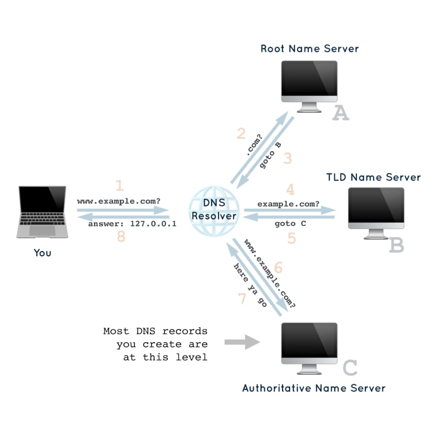

## Introduction

Domain Name System (DNS) is something which we all use everyday without knowing the internal workings of it. How does a url we enter in our browser gets redirected to a specific server? How is it so fast? If you have setup any website you might be familiar with adding A record and CNAMEs. But what are they? What `@` as a host means? When to use what? This article try to answer all these questions. We will cover what DNS is, how does it work, what are different DNS records and their use cases.

## What is a Domain Name?

Lets first understand what a domain name is before we can jump into DNS. A domain name is a unique text identifier for a website or server. The domain name for this website is `arbazsiddiqui.me`. A domain has following structure :

```
<subdomain>.<domain>.<TLD>
```

Lets understand this via an example of `blog.arbazsiddiqui.me`.

`.me` is the `Top Level Domain (TLD)`. This is the root of the domain and encompasses all domains in it. `.com`, `.org`, `.io` are all example of TLDs. `arbazsiddiqui` is the `domain` and technically a `subdomain` of `.me`. `blog` is a subdomain of `arbazsiddiqui`. We can chain this as far as we want, only thing to understand here is that `TLD` is the root and all subsequent domains are `subdomains` of the previous one.


## What is DNS?

The Domain Name System (DNS) is the phonebook of the internet. DNS is mechanism which is responsible for converting human friendly urls like `arbazsiddiqui.me` to machine understandable IP addresses (`104.198.14.52` in this case). Each device connected to the Internet has a unique IP address which other machines use to find the device. DNS servers eliminate the need for humans to memorize IP addresses. 

## How does DNS work?

The process of finding a host name's IP address is called DNS resolution or DNS lookup. A server queries a bunch of other servers if they have the IP address of requested domain name. The other server might not know the IP of the requested domain but will point it to another server which might know it. After following up this chain we will eventually end up with the IP address of our domain. 

A DNS resolution will typically require 4 hops (in a non cached scenario). 

1. **DNS Resolver** : The recursive resolver is the computer that responds to a recursive request from a client and takes the time to track down the DNS record. It will query all other subsequent servers on your behalf and after finding the IP address will respond with it.

2. **Root nameserver** : This is the first step towards finding the IP of requested domain. A root nameserver has the IP address of TLD nameservers. So if you are requesting `example.com`, root nameserver will point DNS resolver to the IP address of TLD nameserver for `.com` and DNS resolver can process from there.

3. **TLD nameserver** : TLD nameservers contain the IP addresses of all the subdomains which are the part of their TLD. So in our case of `example.com`, the `.com` TLD (which was pointed to use by `root nameserver`) will point DNS resolver towards the `Authoritative nameserver` of `example.com`. 

4. **Authoritative nameserver** : An authoritative DNS server is a server that actually holds, and is responsible for, DNS resource records. This is the server at the bottom of the DNS lookup chain that will respond with the queried resource record, ultimately allowing the web browser making the request to reach the IP address needed to access a website or other web resources. In our case, it will respond back with IP address `104.198.14.52` to the DNS resolver which will respond the same back to client. This marks the complete chain of a DNS lookup.



To know the IP address of a domain name you can simple do : 

```terminal
dig arbazsiddiqui.me +short

104.198.14.52
```

`104.198.14.52` is the IP address of server hosting `arbazsiddiqui.me`.

## DNS Records 

DNS records are instructions that live in authoritative nameservers and provide information about a domain including what IP address is associated with that domain and how to handle requests for that domain. You as website owner are responsible for telling the Authoritative nameserver (the last stop in DNS lookup) the address of the server your website is hosted on. DNS records allows you to do multiple things such as adding subdomains. A record typically consist of three things a `Type`, a `Host` and a `Value`. Lets look at record types one by one.

### A records

An A record maps a domain name to an IPv4 address. It’s what you use to point `arbazsiddiqui.me` to `104.198.14.52`.

| Type          | Host          | Value     | TTL |
| :-----------: |:-------------:| :--------:| :---:|
| A     | @ | 104.198.14.52    | 14400 |

The above record means that when someone types `arbazsiddiqui.me` in the browser, the request will be directed to server on IP `104.198.14.52`. The `@` here indicates that this is a record for the root domain, and the ‘14400’ value is the TTL (Time To Live), listed in seconds. This means that if an A record gets updated, it takes 240 minutes (14400 seconds) to take effect.

> Some registrars like goDaddy call Host as Name.

The `AAAA` record does the same for IPv6

### CNAME
A CNAME record is used when a domain or subdomain is an alias of another domain. In other words when you want to add a subdomain like `www` or `blog` to 
`arbazsiddiqui.me`. The CNAME record's value is **always** another domain and NOT the IP address. Hence if you want to add a subdomain `www` to `arbazsiddiqui.me`, it will look like this : 

| Type          | Host          | Value     | TTL |
| :-----------: |:-------------:| :--------:| :---:|
| CNAME     | www | arbazsiddiqui.me    | 14400 |

This record states that when `www.arbazsiddiqui.me` is typed in browser, trigger a lookup for `value` which in this case is `arbazsiddiqui.me`. This will eventually serve the A record for `arbazsiddiqui.me` from above section. So CNAMEs can point to other domains or subdomains but the chain will eventually end up to an A record which will be used to serve website.

CNAME can also be used to point to another app hosted somewhere like heroku or netlify.

| Type          | Host          | Value     | TTL |
| :-----------: |:-------------:| :--------:| :---:|
| CNAME     | www | trusting-jennings-f13c44.netlify.com	    | 14400 |

### TXT 
The text record let’s a domain administrator enter text into the DNS record. It is most commonly used to determine the ownership of the domain. For example to claim a domain on google search console you will have to add a token as TXT record so that google knows that you are the legit owner of your domain. 

| Type          | Host          | Value     | TTL |
| :-----------: |:-------------:| :--------:| :---:|
| TXT     | @ | google-site-verification=xyz	    | 14400 |

### MX
The mail exchange record directs email to a mail server. The value of MX record should be a domain.

| Type          | Host          | Value     | Priority |TTL |
| :-----------: |:-------------:| :--------:| :-----:|:---:|
| MX     | @ | mailhost.example.com|	 3   | 14400 |
| MX     | @ | mailhost2.example.com|	 4   | 14400 |

The new field `priority` here indicates the the order in which the message will be tried. Here `mailhost.example.com` will be tried first as it has higher priority and if it fails it will try `mailhost2.example.com`.

## Caching

In [DNS lookup](#how-does-dns-work) section we saw that a DNS resolution is a 4 hop process, but on a good internet connection things work in a seem less manner. DNS uses UDP protocol which is fast but still doing so many resolution so quickly wont be possible without introducing caching. DNS responses are cached at many different levels. In your browser, in your domestic router, and also in intermediary networking hardware.

And if there’s caching, there’s also a way to expire the cache, and that’s the TTL (time to live). Any DNS record will have an associated TTL value, and that’s how much time their value can be stored (cached) by any involved party. You can change this at any time from the DNS server.

## Hosts File

All OS provides us with a `hosts` file. We can keep a list of domains and their respective IP addresses here. If a domain is listed here, it will take precedence over the normal DNS lookup flow and the clients will directly try to connect with IP listed against an IP. A line from `hosts` file looks like this : 

```
127.0.0.1	localhost
```

Adding the websites you visit the mosts and their respective IPs might seem a good idea and will definitely save you some time spent in resolution but its too much of a hassle to keep this updating if the IP changes or as you get addicted to more websites. For this use case we can use tools like [dnsmasq](http://www.thekelleys.org.uk/dnsmasq/doc.html) which is light weight caching server.

However hosts file is great way to check your new server without changing anything publicly, just edit this file and manually set your domain to point to the IP address of your new server, and you’ll be able to test it for real with a browser.


Another great use case of hosts file is to block unwanted sites by adding their domain to loopback IP `127.0.0.1`. This can be done to block ads, malwares or cure reddit addiction. Just add following lines to your `/etc/hosts` file: 

```
127.0.0.1 www.reddit.com
```

## Conclusion

Its easy to forget the internal workings of internet behind all the cat videos. DNS resolution is one such internal mechanism which makes up the internet and its good to know how it works under the hood. In this article we learned what is DNS and how does a url in browser gets converted to an IP address. We also looked at DNS records and their respective use cases.